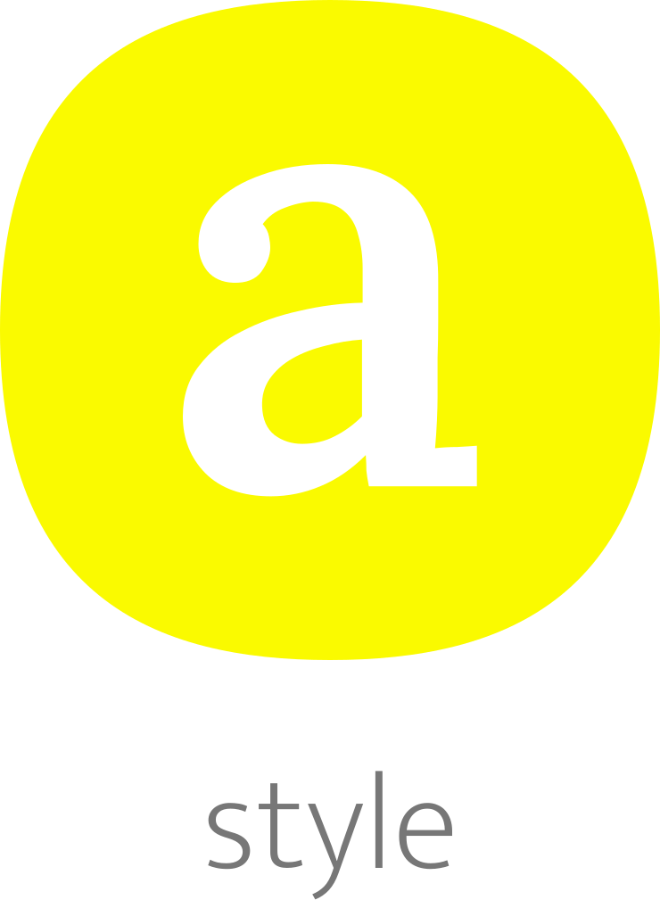

</br >
</br >

<p align='center'>
  <a target='_blank' rel='noopener noreferrer' href='#'>
    
  </a>
</p>

<h1 align='center'>AMAUI Style</h1>

<p align='center'>
  JS CSS framework agnostic solution
</p>

<br />

<h3 align='center'>
  <sub>MIT license&nbsp;&nbsp;&nbsp;&nbsp;</sub>
  <sub>Production ready&nbsp;&nbsp;&nbsp;&nbsp;</sub>
  <sub>UMD 30.9kb gzipped&nbsp;&nbsp;&nbsp;&nbsp;</sub>
  <sub>100% test cov&nbsp;&nbsp;&nbsp;&nbsp;</sub>
  <sub>Browser and Nodejs</sub>
</h3>

<p align='center'>
    <sub>Very simple code&nbsp;&nbsp;&nbsp;&nbsp;</sub>
    <sub>Modern code&nbsp;&nbsp;&nbsp;&nbsp;</sub>
    <sub>Junior friendly&nbsp;&nbsp;&nbsp;&nbsp;</sub>
    <sub>Typescript&nbsp;&nbsp;&nbsp;&nbsp;</sub>
    <sub>Made with :yellow_heart:</sub>
</p>

<br />

## Getting started

### Add

```sh
  // yarn
  yarn add @amaui/style

  // npm
  npm install @amaui/style
```

### Use

```javascript
  import { style } from '@amaui/style';

  const styles = style(theme => ({
    '@keyframes a': {
      '0%': {
         color: 'white',
      },
      '40%': {
         color: 'yellow',
      },
    },

    body: {
        '@pure': true,
        margin: 40,
    },

    main: {
        '@p': true,
        margin: 40,
    },

    '@pure': {
        a: {
          margin: 4,
        },
    },

    a: {
        width: 100,

        'max-width': 100,

        // Simple
        background: '#faa',

        margin: '0 14px 4px 40px',

        // rtl
        marginLeft: 41,
        float: 'left',

        // sort
        paddingLeft: 41,
        padding: 40,

        // prefixes
        position: 'sticky',
        transition: 'all .4s ease',
        maskOrigin: 'inherit',
        maskImage: 'linear-gradient(rgba(0, 0, 0, 1.0), transparent)',
        maskPosition: '40% 74%',

        // animation
        animation: '$a .4s ease',
    },

    // Additionaly nested
    a1: {
        color: 'yellow',

        '& .a14': {
          color: 'white',

          '& > a': {
              color: 'yellow',

              '&:active': {
                color: 'orange',

                // rtl
                marginLeft: 40,
                float: 'left',

                // sort
                padding: 40,
                paddingLeft: 41,

                // prefixes
                position: 'sticky',
                transition: 'all .4s ease',
                maskOrigin: 'margin-box',
                maskImage: 'linear-gradient(rgba(0, 0, 0, 1.0), transparent)',
                maskPosition: '40% 74%',
              }
           }
       },
    },

    a2: {
        // Function
        background: props => props.a === 1 ? 'yellow' : 'orange',
    },

   a3: props => props.a === 1 ? {
      width: 100,

      // animation
      animation: '$a .4s ease',
   } : {
      width: 100,

      'max-width': 100,

      // Simple
      background: 'orange',
   },
  }));

  // Add
  const response = styles.add();

  // At this moment all the static sheets and instances of dynamic ones
  // have been added to the DOM and in response
  // you have all their made classNames, classes and keyframes
  // values to add to your html, vue, react elements, etc.

  // Response
  // {
  //   ids: {
  //     static: [
  //       '1b2b0876-238b-416e-b10b-c01f8dbdfd76'
  //     ],
  //     dynamic: [
  //       '4a4e395b-2db7-4619-ad12-f17737a0d3d1'
  //     ]
  //   },
  //   classNames: {
  //     a: 'a-0',
  //     a1: 'a1-1',
  //     a2: 'a2-2',
  //     a3: 'a3-3'
  //   },
  //   classes: {
  //     a: 'a-0',
  //     a1: 'a1-1',
  //     a2: 'a2-2',
  //     a3: 'a3-3'
  //   },
  //   keyframes: {
  //     a: 'a-0'
  //   }
  // }

```

### Dev

Install

```sh
  yarn
```

Test

```sh
  yarn test
```

### Prod

Build

```sh
  yarn build
```

### Docs

Might be soon...
